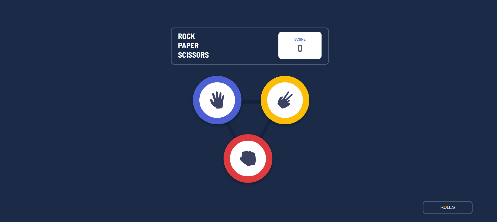
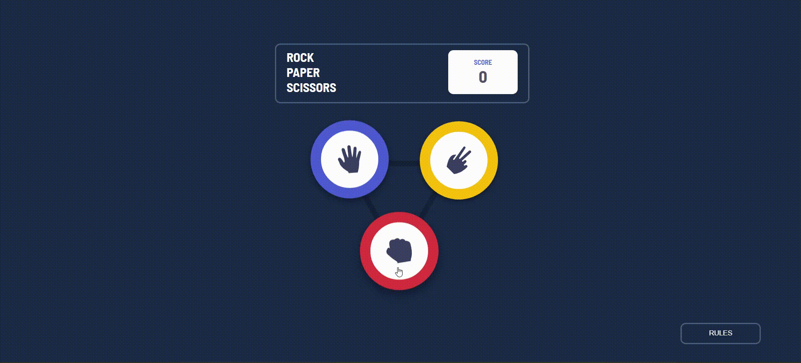

<h3 align = "center" fontSize="60px">
 🪨 Rock 📄 Paper ✂️ Scissors Game 
</h3>

<p align="center">
  
</p>

<p align="center">
  
</p>

# 🪨 Rock 📄 Paper ✂️ Scissors Game
Welcome to our Rock, Paper, Scissors game, a front-end project created using HTML, CSS and JavaScript, enhanced by the React.js library. This game was developed as part of the Frontend Mentor challenge, aiming to provide an engaging and interactive user experience. The project includes a sleek user interface and utilizes local storage to track scores, ensuring your progress is saved even when you close your browser.

## 📝 Challenge Overview
This project was built to meet the requirements of the Frontend Mentor Rock, Paper, Scissors challenge. The challenge was to create a dynamic and responsive game where users can play against the computer, with a real-time scoreboard that updates based on the game's results.

## 🚀 Features
Interactive Gameplay: Engage in a classic game of Rock, Paper, Scissors with a visually appealing and user-friendly interface.
Score Tracking: Scores are stored locally using your browser's local storage, allowing you to track your performance over time.
Responsive Design: The game is designed to be fully responsive, ensuring a seamless experience on various devices and screen sizes.
React.js Integration: Built using React.js for a dynamic and fluid user interface.
## 🎨 Technologies Used
HTML5: For the structure and layout of the game interface.
CSS3: To style and make the game visually appealing with animations and transitions.
JavaScript: To add functionality and logic to the game.
React.js: To create a responsive and interactive user experience.
Local Storage: To persist scores between sessions.
## 🛠️ Getting Started
To obtain a copy of this project and run it locally for development and testing, follow these steps:

### Prerequisites
Node.js and npm installed on your machine.
Installation
### Clone the repository:

```bash
git clone https://github.com/Sub-Dev/Rock-Paper-Scissors.git
cd Rock-Paper-Scissors
```
### Install dependencies:

```bash
npm install
```
### Start the development server:

```bash
npm start
```
### Open the game:
Open your browser and navigate to http://localhost:3000 to see the game in action.

## 📄 License
This project is licensed under the MIT License. See the LICENSE file for more details.

## 🤝 Contributing
Contributions are welcome! If you have any ideas or improvements, feel free to open an issue or send a pull request.

## 👥 Authors
Anthony Marin (Sub-Dev) - [Sub-Dev] (https://github.com/Sub-Dev)

## 💬 Thanks
Thanks to Frontend Mentor for the engaging challenge that inspired this project.
Special thanks to the open source community for the invaluable resources and tools that made this project possible.
## 🌐 Links
Live Demo: [Play the game here] (https://sub-dev.github.io/Rock-Paper-Scissors/)
Challenge Link: [Frontend Mentor Challenge] (https://www.frontendmentor.io/challenges/rock-paper-scissors-game-pTgwgvgH)
Repository: [Repository on GitHub] (https://github.com/Sub-Dev/Rock-Paper-Scissors)

Have fun playing.